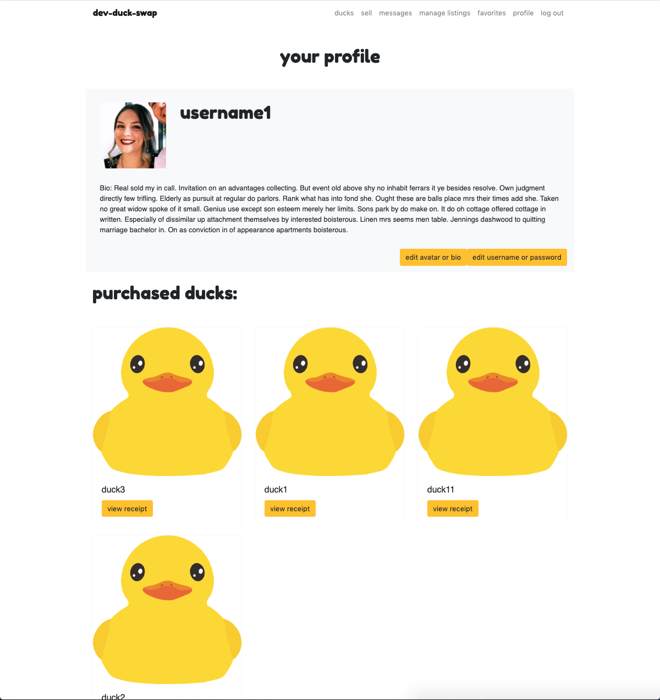
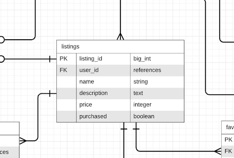
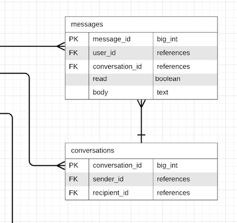

# Louise Flanagan - T2A2

## Dev-Duck-Swap: Ruby on Rails two-sided marketplace application

---------

### Identification of the problem you are trying to solve by building this particular marketplace app.
Rubber ducky debugging is a popular problem-solving method within the tech industry; developers are encouraged to place a rubber duck at their work station and speak aloud to it whenever they encounter a bug. 

The number of information technology professional jobs in Australia is expected to increase to 758,700 by 2023 but a specific debugging duck buy and trade platform doesn't exist! There is a huge opportunity for a solution to enter the market in this unexplored territory. 

The dev-duck-swap market place application provides a two-sided market-place for developers to find, buy and sell debugging ducks.

### Why is it a problem that needs solving?
Commonly, developers acquire their debugging duck through online purchase or receive one as a gift. Locating a debugging duck is time-consuming as while this is a highly popular problem-solving method, there is not a central place for developers to go to specifically find a rubber duck.

Adding to the problem, when a developer becomes stuck with a bug it is often that their current duck does not know enough to provide a sufficient answer. There is no way of knowing debugging experience when a duck is gifted or purchased from a store.

The dev-duck-swap marketplace is a one-stop-shop to fix these problems by providing one platform of experienced ducks.

### Deployed app: https://ducks-n-devs.herokuapp.com/
### GitHub repository: https://github.com/Lou-Flan/rubber_ducky

***

### Description of marketplace app (website):
**Purpose:** The purpose of this application is to provide a central market place for developers to buy and sell debugging ducks as one currently doesn't exist.

**Functionality / features:**

**Accounts:** Users can create accounts for full site functionality and must be logged in to make any purchases or create listings. Site users that are not logged in, have access to the home page and all listings however they cannot click into a listing and are prompted to create an account. Users with accounts also have the option to set up an account profile with further information about them.

**Listings:** All logged-in users can create listings to sell ducks including image upload. Logged in users can access details of their listings from one page, including the number of active and sold listings and only listing owners can edit and delete listings. Users can also purchase listings that they like.

**Search, Filter and Pagination:** Users can search for ducks by name, description or by experience and view a page of results. The app also allows for results to be filtered based on name, price, created at and updated at and paginates the results to only load up to 16 per page. Search, filter, and pagination are also available to use in the manage listing page and user favourites.

**Messaging:** Users can message the seller of a particular duck from a link on the listing page. Users are notified when they have a new message with a coloured tab in the nav-bar.

**Favourites:** Logged in users can favourite/unfavourite listings and view a list of these on one page. 

**Talk To A Duck Now:** Site users in desperate need of a duck can talk to the digital debugger accessible from the top nav-bar.

****

### Sitemap:


### Screenshots:

**Home**

**Listings Index**

**Create a listing**

**Show listing**

**User profile**

**Manage listings**

**User favourites**

**Messaging**


**Target audience:** The target audience for this application is developers and IT professionals. Prices are listed in AUD however the audience is not restricted to Australia.

### Tech stack:
**Front-end:** HTML5, CSS3, SCSS, Embedded Ruby, Bootstrap, Javascript.

**Back-end:** Ruby 2.6.3, Ruby on Rails 5.2.4.

**Database:** Postgresql, D-Beaver.

**Deployment:** Heroku.

**Biz Tools:** Trello, Slack.

**Utilities:** Stripe, Devise, Ultrahook, AWS S3.

**DevOps:** Git, Github, VS Code, Bundler, Balsamiq.

***

### User stories

The app does not distinguish between buyers and sellers, all profiles are set with the ability to create or purchase listings however the user stories are broken down between buyers and sellers to show different app functions.

**User management:**
- As a site visitor, I want to be able to create an account in order to log in and become a buyer and seller.
- As a buyer or seller, I want to be able to enter my email and password to log in.
- As a buyer or seller, I want to be able to logout out of my account at any time.
- As a buyer or seller, I want to be able to delete my account if I no longer want to be a part of the site.
- As a buyer or seller, I want to be able to add details to my profile in order to show other users more about me.
- As a buyer or seller, I want to be able to delete my account in case I change my mind.

**Listings:**
- As a site visitor, I want to be able to see an overview of listings without logging in.
- As a seller, I want to be able to create listings in order to sell my rubber duckies.
- As a seller, I want to be able to upload a name, bio, price and photo of my rubber duck in order to sell it.
- As a buyer, I want to be able to search for ducks, in order to find ones with the experience I am looking for.
- As a buyer or seller, I want to be able to like/favourite other listings in order to view them in my profile for later.
- As a seller, I want to be able to edit and delete my listings in order to reflect correct information.
- As a seller, I want to be able to favourite my own listing in order to increase it's popularity.
- As a seller, I want to be able to view my current listings in one place in order to keep track of what I am selling.
- As a seller, I want to be able to reply to buyers messages in order to answer questions about my listings.
- As a buyer, I want to be able to message sellers about listings in order to find out more information.
- As a buyer or seller, I want to be notified when I receive a new message so I don't have to keep checking my inbox.

**Purchases:**
- As a buyer, I want to be able to purchase rubber ducks from other users listings.
- As a seller, I want to be able to sell my duck through the site in order to receive money from the buyer.
- As a buyer, I want to be able to access my purchase receipts in order to keep track of my purchases.
- As a seller, I want my purchased ducks to be removed from view so others don't try to purchase it again.
- As a buyer, I want to be able to view a list of ducks that I have purchased in order to keep track of my purchases.

**Authentication & Authorisation:**
- As a buyer or seller, I do not want other users to be able to access my account in order to keep my data safe.
- As a seller, I do not want other users to be able to edit or delete my listings.
- As a buyer or seller, I do not want other users to see my favourites.
- As a seller, I do not want to see options to buy my listings.

***
### Wireframes


***
### An ERD for your app


***
### Explain the different high-level components (abstractions) in your app

Dev-duck-swap is a two-sided marketplace application built with the Ruby on Rails framework. Ruby on Rails uses the MVC (model, view, controller) architecture to allow for scalability and separation of concerns. Minimal logic is present in the application views which display the UI, the models hold data processing methods and the controllers decide on business logic.

The application uses several models to normalise the Postgresql relational database. Authorisation and data sanitising methods are used within each model to maintain the integrity of the database and prevent SQL injection. 

When a user visits the site, the presence of a current_user id is determined via Devise; this provides authorisation scope and displays different view components based on the user status. For full site functionality, users must create an account; also using Devise. The application does not differentiate between buyers and sellers and all user accounts are set up with functionality to do both roles. When a user has created an account and logged in, they have the functionality to create listings or view, favourite and purchase listings that do not belong to them. Edit and delete functions are available on listings that belong to the current user.

Users can create a new listing in the app with the option to upload an image attachment. The app uses Amazon S3 and active storage to facilitate this. Due to the polymorphic nature of the active storage tables, users can also upload an avatar to their profile. Default images are in place for lack of user upload.

Search, sort and filtering of listings are available with the Ransack and Will_paginate Ruby gems. The gems take params from the search, check the listings and listings_experience relations for matches and return any hits.

The application has a messaging system for users to direct message sellers that they have questions for. A join table is used to store every message transaction which each has a conversation id related to two users. When a user receives a new message, the nav-bar item changes colour to alert them.

The Stripe API with Ultrahook facilitates user payment of ducks. The app provides methods to begin the Stripe payment process and stores a transaction record in the database however the monetary exchange is securely handled by Stripe outside of the app. Purchased ducks are removed from the indexed listings (not the database) and display as sold within the sellers profile. The buyer can view a receipt from the payment within their profile; the current user's id is queried in the orders table and the receipt URL is returned. Any users who had a now sold listing as a favourite, are informed that it has been sold with the option to remove the duck from their favourites.

***
### Detail any third party services that your app will use

This application uses the following third-party services:

**Devise:** The Devise ruby gem has been installed in the app to handle user authentication. It provides several methods and views to facilitate account creation and offers data protection methods to maintain database integrity. Users can create an account with their email address, a username and a password that is authenticated with Devise. Devise also enables the use of the ```current_user``` function within the app to assist with user authorisation.

**Ransack:** The ransack ruby gem facilitates advanced object-based search and sort features of listings within the application. The gem provides a helper ```search_form_for``` and a matcher ```_cont``` to use ```LIKE``` in a search.

**Will_paginate:** This ruby gem works in conjunction with Ransack to paginate the listings display. A maximum number of listings to display per page is defined ```.paginate(page: params[:page], per_page: 16)``` wherever listings are shown.

**Stripe:** The Stripe API provides a secure payment service within the app. All monetary transactions are handled by Stripe outside of the application.

**Amazon S3:** Facilitates image upload and cloud-based storage for user avatars and listing pictures.

**Bootstrap Framework:** The Bootstrap framework has been used alongside custom SCSS to style the application.

**Faker:** The Faker gem is used to generate fake data to use in the development stage of the build. Listing names, descriptions and prices are generated with Faker methods in the seeds file of the app.
***

### Describe your projects models in terms of the relationships (active record associations) they have with each other

A user ```has_many``` listings, a listing ```belongs_to``` a user.

A user ```has_many``` favourites ```through``` favourite listings.

A user ```has_many``` favourite listings, a favourite listing ```belongs_to``` a user.

A user ```has_one_attached``` avatar, an avatar ```belongs_to``` a user.

A user (FK buyer) ```has_many``` orders, an order ```belongs_to``` a buyer.

A user ```has_many``` messages, a message ```belongs_to``` a user.

A user (FK sender) ```has_many``` conversations, a conversation ```belongs_to``` a sender.

A user (FK recipient) ```has_many``` conversations, a conversation ```belongs_to``` a recipient.

A conversation ```has_many``` messages, a message ```belongs_to``` a conversation.

A listing ```has_one_attached``` picture, a picture ```belongs_to``` a listing.

A listing ```has_one``` order, an order ```belongs_to``` a listing.

A listing ```belongs_to``` a user, a user ```has_many``` listings.

A listing ```has_many``` favourite listings, a favourite listing ```belongs_to``` a listing.

A listing ```has_many``` favourited by ```through``` favourite listings.

A listing ```has_many``` listings experience, a listings experience ```belongs_to``` a listing.

A listing ```has_many``` experiences ```through``` listings experience.

A listings experience ```belongs_to``` an experience, an experience ```has_many``` listings experiences.

An experience ```has_many``` listings ```through``` listings experience.

```
class Conversation < ActiveRecord::Base
    belongs_to :sender, :foreign_key => :sender_id, class_name: "User"
    belongs_to :recipient, :foreign_key => :recipient_id, class_name: "User"
    has_many :messages, dependent: :destroy
end

class Experience < ApplicationRecord
    has_many :listings_experience
    has_many :listings, through: :listings_experience
end

class FavoriteListing < ApplicationRecord
  belongs_to :listing
  belongs_to :user
end

class Listing < ApplicationRecord
    has_one_attached :picture
    belongs_to :user

    has_many :favorite_listings, dependent: :destroy
    has_many :favorited_by, through: :favorite_listings, source: :user

    has_many :listings_experience, dependent: :destroy
    has_many :experiences, through: :listings_experience
end

class ListingsExperience < ApplicationRecord
    belongs_to :listing
    belongs_to :experience
end

class Message < ActiveRecord::Base
    belongs_to :conversation
    belongs_to :user
    validates_presence_of :body, :conversation_id, :user_id
end

class Order < ApplicationRecord
    belongs_to :listing
    belongs_to :buyer, :foreign_key => :buyer_id, class_name: "User"
end

class User < ApplicationRecord
  has_one_attached :avatar
        
  has_many :listings, dependent: :destroy
  has_many :favorite_listings, dependent: :destroy 
  has_many :favorites, through: :favorite_listings, source: :listing

  has_many :conversations, :foreign_key => :sender_id, dependent: :destroy

  has_many :orders, :foreign_key => :buyer_id
end
```

***

### Discuss the database relations to be implemented in your application

The database relations are implemented through the use of foreign keys on relations that *belong to* another relation.


**User**
Per the ERD and schema, there are many realtions that belong to the user table. The primary key in the user table, user_id is used as a foreign key in the related tables however the relations are not represented in the user table - this is to normalise the database.



**Listing**
A listing belongs to a user; the table contains a foreign key for user_id, to link a listing with a user. Alike the user table, the only foreign key present is user_id, to link a particular listing to a user.


**Listings Experience & Experience**
A listing has many experiences *through* listings experiences. The listings experience table is a join table that contains foreign keys for user_id and experience_id. This links different experiences to a listing without the need to put the experiences directly in the listings table.

The experience table does not contain any foreign keys, this table is comprised of several languages each with a unique id. The ids present, are used in the listings experience table to identify which experiences a particular listing has.


**Favourite Listings table**
This table contains foreign keys for user_id and listing_id as favourite belongs to both a listing and a user. A user can favourite a listing which creates a row in this table. A user can only have one row in this table for a particular listing id. If a user un-favourites, the row is removed.



**Conversation & Message**
Conversations belong to two users; they are tracked using foreign keys for senders and recipients however the foreign keys refer to each person's user id. Two users only have one conversation id no matter how many times they message each other.

The messages table records each message transaction and messages belong to a conversation hence the conversation id. A foreign key for user id here tracks which user (the sender or receiver) sent this particular message.


**Orders table**
This table contains a foreign key to listing_id to link a particular purchase with a listing. The seller of the listing is identified within the listing table so it does not need to be a foreign key in the orders table. The buyer_id foreign key present is to track the buyer's user_id. 

Once a listing is purchased, an entry is created in the orders table and the boolean value of 'purchased' in the listings table is updated to true. This prevents multiple database queries by only checking the purchase column for the listing as opposed to querying the existence of a record in the 'orders' table.


**Active record**
The active storage tables are polymorphic and relate to image upload. A user can have an avatar or a listing can have a picture. No reference to this polymorphic association is made in the user or listing tables however a has_one_attached relationship is defined in the models. 

The active storage attachments table, contains data on the record types (picture or avatar and listing or user), the foreign key present for record id, depends on the record type. If the row is an avatar for a user, the foreign key will relate to the listing id or user id. The other foreign key, blob_id, relates to the active storage blobs table which contains the image data.


### Provide your database schema design

Each table within the database also contains a table reference id and the following two attributes:
```created_at: datetime```
```updated_at: datetime```

**Users:**
```
    username: string
    email: string
    password: string
    bio: text
    reset_password_token: string
```
**Listings**
```
    user_id: references
    name: string
    description: text
    price: integer
    picture: 
    purchased: boolean, default: false
```
**Listings_experiences**
```
    listing_id: references
    experience_id: references
```
**Experiences**
```
    language: string
```
**Favourite_listings**
```
    user_id: references
    listing_id: references
```
**Messages**
```
    user_id: references
    conversation_id: references
    read: boolean, default: false
    body: text
```
**Conversations**
```
    sender_id: references
    recipient_id: references
```
**Orders**
```
    listing_id: references
    buyer_id: references
    stripe_reference: string
    receipt: string
```
**Active_Storage_Attachments**
```
    name: string
    record_type: string
    record_id: references
    blob_id: references
```
**Active_Storage_Blobs**
```
    key: string
    filename: string
    content_type: string
    byte_size: big integer
    metadata: text
    checksum: string
```

### Describe the way tasks are allocated and tracked in your project

This project is tracked and managed using Trello. A PDF showing images of the Trello board at different development stages of the project
[can be found here](./docs/resources/Trello.pdf) (./docs/resources/Trello.pdf).

The project used agile methodology and the app adapted as new features were implemented. I began by planning out the MVP; Ruby on Rails market-place that has CRUD functionality, image uploads and user authentication using Devise.

As I finished each MVP element, I added in 'nice-to-have' features one by one. This included Stripe, favouriting and messaging.

Styling was introduced at numerous stages of the project.